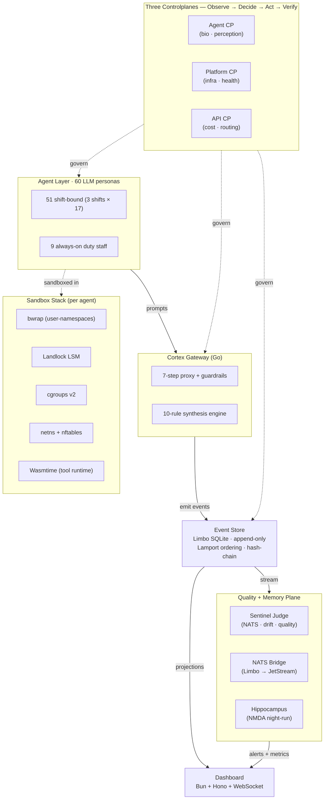

# Project Sentinel

[](https://github.com/silentspike/project-sentinel/actions/workflows/ci.yml)
[](https://github.com/silentspike/project-sentinel/actions/workflows/codeql.yml)
[](https://github.com/silentspike/project-sentinel/actions/workflows/scorecard.yml)
[](LICENSE)
[](https://github.com/silentspike/project-sentinel/releases)
[](#)

A reference testbed for runtime governance of LLM coding agents.

When teams put LLM agents into real workflows, three operational questions
come back:

- How are they sandboxed?
- How are their actions audited?
- What happens when something goes wrong?

Project Sentinel makes those questions concrete. It runs a synthetic
office workload — sixty personas across three shifts, with real LLM calls —
and underneath it the runtime layer an organization would actually
operate: per-agent sandboxing (bwrap + Landlock + cgroups + netns),
event-sourced audit trails, three independent control planes, and a
9/9-passing breakout test report.

The full stack is documented as a TOGAF v22.1 architecture and runs on a
provisioned VM. The included docker demo is a deliberate behavioral
subset: it shows the workload and dashboard, but not the kernel-bound
parts (eBPF, Landlock, FUSE) that need a real host.

[Architecture Guide (TOGAF v22.1)](docs/architecture/togaf-architecture-guide.html) ·
[Sandbox Test Report (9/9)](docs/security-test-report.md) ·
[Demo](#demo-one-command)

## Why It Exists

Three things are hard to study without a believable, persistent, multi-agent
environment:

1. **Sandbox primitives at scale.** What does bwrap + Landlock + cgroups
   v2 + netns actually cost when 26 agents tick simultaneously? Where do
   the breakouts come from when nobody is looking? The
   [security test report](docs/security-test-report.md) records 9/9
   breakout tests passing.
2. **Controlplane design.** Three independent observe / decide / act /
   verify loops (Agent CP, Platform CP, API CP) co-exist. Each owns one
   decision domain, none reach across. See
   [docs/governance.md](docs/governance.md).
3. **Boundary detection.** Pattern detector for agent self-recognition (15
   regex + two-stage LLM judge) measures when a generation surfaces awareness
   markers; the synthesis engine intercepts ~70% of routine perceptions
   before they reach a real LLM call. See
   [Research Context](#research-context) for the narrative convention that
   underpins the workload.

## Architecture at a Glance



| Layer            | Tech                                      |
|------------------|-------------------------------------------|
| World simulation | Rust workspace (15 crates), `bevy_ecs`    |
| LLM gateway      | Go (`cmd/cortex-gateway`)                 |
| Quality monitor  | Go (`services/sentinel-judge`)            |
| Dashboard        | Bun + Hono + vanilla-JS (`dashboard/`)    |
| Pub/Sub          | Zenoh (Rust SHM <10 µs) + NATS JetStream  |
| Storage          | redb (state) + Limbo SQLite (events)      |

For a terminal-friendly plain-text view of the same data flow see
[Architecture Details](#architecture-details) further down.

For per-cluster implementation status see
[docs/togaf-gap-v22.md](docs/togaf-gap-v22.md).
For deliberate deviations from the spec see
[docs/togaf-deviations-v22.md](docs/togaf-deviations-v22.md).

## Quick Start

### Prerequisites

| Tool        | Version  | Purpose                       |
|-------------|----------|-------------------------------|
| Rust        | 1.93+    | ECS world, all Rust crates    |
| Go          | 1.23+    | Gateway, judge, nats-bridge   |
| Bun         | 1.x      | Dashboard                     |
| cargo-remote (optional) | latest | Remote build server  |
| Docker + Compose | 24+ | Demo stack                    |

### Configure

Sentinel takes deployment-specific values from a single local file. Copy
the templates and fill in your own values:

```bash
cp .env.example .env
cp .make.local.example .make.local
```

The `.env` file holds runtime values (NATS URL, dashboard port). The
`.make.local` file holds build values (cargo remote server address, deploy
target). Neither file is committed.

### Build

```bash
make ci          # full: fmt + clippy + test + cargo-deny + typos
make build       # workspace build
make test        # all tests
```

If you have cargo-remote configured for offload builds, those targets
transparently use it.

### Demo (one command)


```bash
make demo                                 # build binaries + image, then run
# or, step by step:
make demo-binaries                        # build sentinel-daemon + sentinel-nightrun
make demo-image                           # docker build
./scripts/demo.sh                         # run + open dashboard, tear down after 10 min
```

The Rust workspace is heavy. `make demo-binaries` uses `cargo-remote`
against a build server if `.cargo-remote.toml` is present, otherwise
falls back to a local `cargo build --release` (~8 GB RAM, ~20 min on
a developer laptop). See [CONTRIBUTING.md](CONTRIBUTING.md) for
cargo-remote setup if you want to offload the Rust compile.

Runs five agents through a 10-minute morning shift with the default
workload configuration. Dashboard: http://localhost:18000 (host port
18000 is used because 8000 is commonly bound by local nginx/dev servers;
adjust in `docker-compose.demo.yml` if you have 8000 free).

#### What the docker demo shows — and what it does not

The compose stack is deliberately a **behavioral demo**, not a full
production deployment. It is meant to give a recruiter or curious reader
a working dashboard in one command, not to reproduce the full sandbox
story.

| Feature                                 | Demo container | VM deploy |
|-----------------------------------------|----------------|-----------|
| ECS world, Bio-Engine, Physics          | yes            | yes       |
| Event sourcing + projections + dashboard| yes            | yes       |
| Cortex Gateway pipeline + synthesis     | yes            | yes       |
| NATS JetStream + sentinel-judge         | yes            | yes       |
| **bwrap + Landlock per-agent isolation**| no (warned)    | yes       |
| **cgroups v2 per-agent resource caps**  | no (warned)    | yes       |
| **netns + nftables agent network**      | no (warned)    | yes       |
| **eBPF probes (aya-rs)**                | no (warned)    | yes       |
| **sentinel-fs CAS-FUSE**                | no (warned)    | yes       |
| Zenoh SHM transport                     | no (TCP only)  | yes       |

These kernel-bound features need user namespaces, `CAP_BPF`,
`CAP_SYS_ADMIN`, `CAP_NET_ADMIN`, and a writeable bpf-fs / `/dev/fuse`.
A plain unprivileged container has none of those. The
`SandboxEnforcer` (`crates/sentinel-sandbox/src/enforcer.rs`) detects
the absence at boot and degrades gracefully — warnings in the daemon
log are the expected demo signal.

For the full stack with sandbox enforcement see
`deploy/systemd/*.service` and the deployment notes in
[docs/governance.md](docs/governance.md).

## Status — what works in this alpha, what doesn't yet

Kernel-bound features are **not missing** — they are *implemented + tested
but not deploy-able in the docker demo*. The VM deploy is the production
target; the docker demo is a deliberate behavioral subset.

| Area | Status | Demo-Container | VM-Deploy |
|------|--------|----------------|-----------|
| ECS world (bevy_ecs), bio + physics + room sim | ✅ implemented + exercised | yes | yes |
| Event sourcing (Limbo SQLite, idempotent, replayable) | ✅ implemented + exercised | yes | yes |
| Cortex Gateway 7-step pipeline + 10-rule synthesis engine | ✅ implemented + exercised | yes | yes |
| Dashboard (Bun + Hono + WebSocket) | ✅ implemented + exercised | yes | yes |
| sentinel-judge quality + drift monitoring (NATS streaming) | ✅ implemented + exercised | yes | yes |
| sentinel-projection CQRS read-models | ✅ implemented + exercised | yes | yes |
| sentinel-nightrun batch consolidation, deterministic replay | ✅ implemented, manual trigger | yes | yes |
| **bwrap + Landlock per-agent isolation** | ✅ implemented + 9/9 breakout-tested (`crates/sentinel-sandbox/`) | **no (kernel-caps)** | **yes** |
| **cgroups v2 per-agent caps** | ✅ implemented | **no (kernel-caps)** | **yes** |
| **netns + nftables agent network** | ✅ implemented | **no (kernel-caps)** | **yes** |
| **eBPF probes (aya-rs)** | ✅ implemented | **no (kernel-caps)** | **yes** |
| **sentinel-fs CAS-FUSE** | ✅ implemented | **no (FUSE)** | **yes** |
| TOGAF v22.1 architecture guide + per-cluster gap report | ✅ shipped in `docs/architecture/` | n/a | n/a |
| 60 LLM-persona agents (`config/agents/AGENT-*.toml`) | ✅ defined; demo runs a 5-agent subset | partial (5/60) | yes (full 60) |
| Pre-built demo binaries (linux-x86_64) on every release | ✅ since v0.1.0-alpha | yes | yes |
| CodeQL pipeline | ✅ green on main | n/a | n/a |
| Tag verified-badge on GitHub | ✅ verified=true (Ed25519) | n/a | n/a |
| OpenGraph social-preview image | ⏳ image in repo (`docs/images/opengraph-preview.png`); upload via repo Settings → Social preview pending (#351) | n/a | n/a |
| Demo binaries for arm64 / Apple Silicon | ⏳ planned (currently linux-x86_64 only) | n/a | n/a |
| Multi-tenant company configs ("Gaia firmen-konfigurator") | ⏳ tracked as roadmap issue (#266) | n/a | n/a |

See [docs/known-limitations.md](docs/known-limitations.md) for the full
caveat list.

## Repository Layout

| Path                         | Contents                                                    |
|------------------------------|-------------------------------------------------------------|
| `crates/`                    | 15 Rust crates (ECS, bio, physics, sandbox, eBPF, …)        |
| `services/sentinel-daemon/`  | Daemon + controlplane                                       |
| `services/sentinel-judge/`   | Quality / drift monitor (Go)                                |
| `services/sentinel-nightrun/`| Nightly consolidation (Rust)                                |
| `services/sentinel-nats-bridge/` | NATS event bridge (Go)                                  |
| `cmd/cortex-gateway/`        | LLM proxy + synthesis (Go)                                  |
| `dashboard/`                 | Bun + Hono real-time UI                                     |
| `pkg/sentinel-go/`           | Shared Go package (judge heuristics, eventstore, messaging) |
| `config/`                    | Agent TOMLs, room layout, simulation parameters             |
| `docs/`                      | Architecture, governance, gap, deviations, glossary         |
| `deploy/`                    | systemd units, release manifest schema                      |
| `.github/workflows/`         | 16 CI workflows (build, test, security, supply chain)       |

## Documentation

| Doc                                                          | Purpose                                       |
|--------------------------------------------------------------|-----------------------------------------------|
| [llms.txt](llms.txt)                                         | LLM-friendly project index (read first)       |
| [docs/architecture/togaf-architecture-guide.html](docs/architecture/togaf-architecture-guide.html) | Authoritative architecture reference (v22.1) |
| [docs/governance.md](docs/governance.md)                     | Governance mechanisms ↔ code path mapping     |
| [docs/togaf-gap-v22.md](docs/togaf-gap-v22.md)               | Per-cluster implementation status             |
| [docs/togaf-deviations-v22.md](docs/togaf-deviations-v22.md) | Intentional deviations from the spec          |
| [docs/glossary.md](docs/glossary.md)                         | Agent-persona narrative + agent-layer glossary |
| [docs/security-test-report.md](docs/security-test-report.md) | Sandbox breakout test results                 |
| [docs/workshop-agent-runtime-boundaries.md](docs/workshop-agent-runtime-boundaries.md) | 45-min hands-on workshop: how to evaluate agent runtime boundaries |
| [CONTRIBUTING.md](CONTRIBUTING.md)                           | How to contribute                             |
| [SECURITY.md](SECURITY.md)                                   | Reporting vulnerabilities                     |
| [CHANGELOG.md](CHANGELOG.md)                                 | Release history                               |

## Architecture Details

Plain-text alternative to the [Mermaid diagram above](#architecture-at-a-glance),
useful for terminal-only viewers and screen-readers. Same data flow, lower
fidelity:

```
Deterministic (ECS)              Probabilistic (LLM)
┌─────────────────────┐          ┌──────────────────────────────────┐
│ bevy_ecs World      │          │ Cortex Gateway                   │
│ Bio / Physics       │ ───────> │ 7-step pipeline                  │
│ 60 agent slots      │ <─────── │ Synthesis engine                 │
│ Event Store         │          │ Self-recognition pattern detector│
└─────────────────────┘          └──────────────────────────────────┘
          │                                   │
          └─────────── Event Sourcing ────────┘
                 (sentinel-limbo, append-only)
```

For full architectural depth (clusters, controlplane internals, deviation
register) see the
[TOGAF v22.1 architecture guide](docs/architecture/togaf-architecture-guide.html)
and the gap report in [docs/togaf-gap-v22.md](docs/togaf-gap-v22.md).

## Release status

This is the first **public** release boundary. The project was developed
privately prior to `v0.1.0-alpha`; the tag marks the boundary between
private development and public visibility, not the start of the project.

CI on `main`: ci, lint, coverage, supply-chain (cargo-deny, npm-audit,
go-vuln, rust-audit), conventional-commits, dependency-freshness — green.
CodeQL goes green on the first scheduled run after the public flip
(GHAS gating). Security: dependency audit + `gitleaks` + `trufflehog` clean,
9/9 sandbox breakout tests passing on a privileged host.

See [docs/known-limitations.md](docs/known-limitations.md) for full caveats
and the [Status table above](#status--what-works-in-this-alpha-what-doesnt-yet)
for the per-feature picture.

## Research Context

The synthetic office workload is a deliberate stress-test for the runtime
layer. The personality model, role taxonomy, and bio-state mechanism are
documented in [docs/research-context.md](docs/research-context.md). The
platform underneath is the work; the workload is the evaluation.

## License

See [LICENSE](LICENSE).
